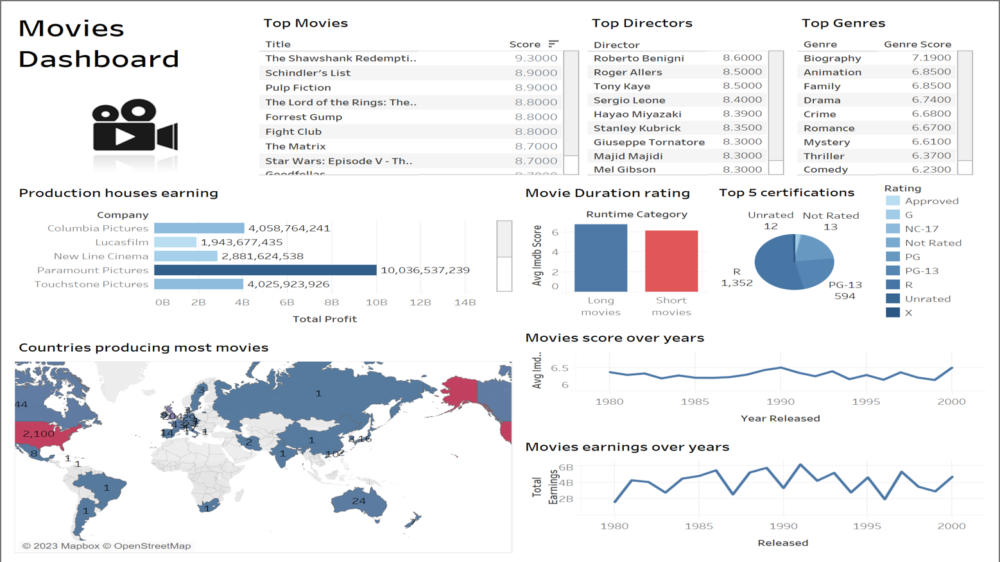
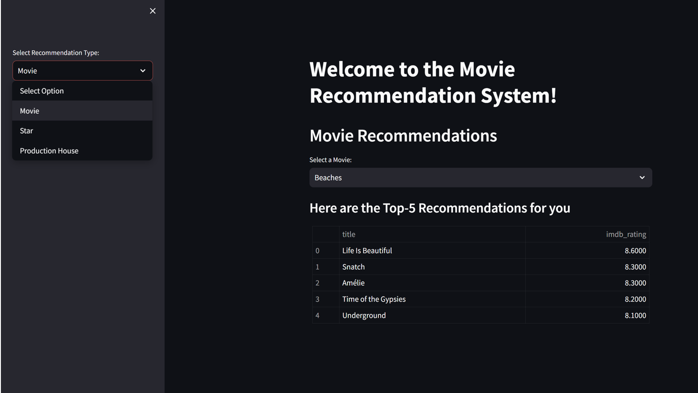

# Movies Analysis & Recommendation System

A comprehensive analysis and recommendation system for IMDB movies data from 1980-2000 using Spark, MySQL, and PySpark.

## Project Overview

This project performs a detailed analysis of IMDB movies data and develops a recommendation system. It leverages Spark for data processing and MySQL for data storage.

## Dashboard



## Streamlit Interface



## Installation

1. **Clone the Repository:**
   ```bash
   git clone https://github.com/YOUR-USERNAME/Movies-Analysis-Recommendation-System.git
   cd Movies-Analysis-Recommendation-System
   ```
 2. **Set Up Virtual Environment:**
   ```bash
   python3 -m venv env
   source env/bin/activate  # On Windows use `env\Scripts\activate`
   ```
3. **Install Dependencies:**
   ```bash
   pip install -r requirements.txt
   ```

## Usage
Data Analysis and Recommendation
Run the data analysis script:
```bash
spark-submit data_analysis.py
```
Run the recommendation system:
```bash
python recommendation_system.py --input <input_movie> --output <output_file>
```
   
